# 웹 프레임워크 기반의 유명인물 영상 분석 서비스

## 1. 목표와 기능

### 1.1 목표

이 프로젝트는 Python, HTML/CSS/JS, Django, MySQL, AWS Lightsail, 그리고 GitHub를 활용하여 유명인물 영상 분석 및 Q&A 웹게시판 사이트를 구현하였습니다. 사용자가 업로드한 사진을 AI가 분석하여 자동으로 답글을 생성하는 기능을 제공하는 사이트입니다.. 이를 통해 사용자들은 특정 인물의 사진을 게시판에 공유하고, 커뮤니티 형성을 촉진하는 것이 프로젝트의 목표입니다

### 1.2 기능

- 유사도 측정 기능


- 유명인물 탐색 및 정보 제공 기능


- ETC

### 3x2 이미지 레이아웃

<p align="center">
    
    
</p>

<p align="center">
    
    
</p>

<p align="center">
    
    
</p>


## 2.1 개발 환경

### 하드웨어 사양

- CPU: Intel Core i7-4770 @ 3.40GHz
- RAM: 16GB
- GPU: 내장 그래픽 (Intel UHD 630)

### 운영체제(OS)

- Windows 10 Home (64비트, 22H2)

### IDE 및 개발도구

- IDE: VSCode
- AI 및 데이터 분석 도구: Google Colab

### 사용 언어

- Frontend: HTML, CSS, JavaScript (JS)
- Backend 및 AI: Python

### Frontend

- JS Library: jQuery
- CSS Framework: Bootstrap

### Backend

- Web Server: NGINX
- WSGI Server: gunicorn
- WAS (Python Web Framework): Django, DBT, FastAPI
- DB: MySQL

### AI 모델 및 데이터 분석

- Python 라이브러리: OpenCV, TensorFlow, PyTorch, ultralytics, MTCNN 등
- AI 모델: YOLO, MTCNN, ResNet34 등

### 배포환경

- 플랫폼: AWS Lightsail
- 운영체제: Ubuntu 가상머신 (EC2)

### 형상관리

- Git, GitHub

## 2.2 배포 URL
- 현제 서버 운영 중단됨
- [도메인은 추후 추가 예정](http://3.34.71.98/)
- 테스트용 계정
  ```
  id : testID
  pw : 0!Code2024
  ```

## 2.3 URL 구조 (모놀리식)

### common

| URL             | View                  | HTML File Name  | Note         |
|-----------------|-----------------------|-----------------|--------------|
| `/`             | IndexView             | `index.html`    | 인덱스 화면  |
| `login`         | CustomLoginView       | `login.html`    | 로그인       |
| `logout`        | auth_views.LogoutView | Null            | 로그아웃     |
| `signup`        | SignupView            | `signup.html`   | 회원가입     |
| handler404      | page_not_found        | `404.html`      | 404 페이지   |

### similarity

| URL                                     | View                           | HTML File Name        | Note         |
|-----------------------------------------|--------------------------------|-----------------------|--------------|
| `similarity/post/create/`               | SimilarityPostCreateView       | `question_form.html`  | 게시물 작성  |
| `similarity/post/read/<int:pk>/`        | SimilarityPostReadView         | `question_list.html`  | 게시물 읽기  |
| `similarity/post/update/<int:pk>/`      | SimilarityPostUpdateView       | `question_form.html`  | 게시물 수정  |
| `similarity/post/delete/<int:pk>/`      | SimilarityPostDeleteView       | Null                  | 게시물 삭제  |
| `similarity/post/vote/<int:pk>/`        | SimilarityPostVoteView         | Null                  | 게시물 추천  |
| `similarity/post/list/`                 | SimilarityPostListView         | `question_form.html`  | 게시물 목록  |
| `similarity/comment/create/<int:pk>/`   | SimilarityCommentCreateView    | Null                  | 댓글 작성    |
| `similarity/comment/update/<int:pk>/`   | SimilarityCommentUpdateView    | Null                  | 댓글 수정    |
| `similarity/comment/delete/<int:pk>/`   | SimilarityCommentDeleteView    | Null                  | 댓글 삭제    |
| `similarity/comment/vote/<int:pk>/`     | SimilarityCommentVoteView      | Null                  | 댓글 추천    |

### Detection

| URL                                     | View                           | HTML File Name        | Note         |
|-----------------------------------------|--------------------------------|-----------------------|--------------|
| `detection/post/create/`                | DetectionPostCreateView        | `question_form.html`  | 게시물 작성  |
| `detection/post/read/<int:pk>/`         | DetectionPostReadView          | `question_list.html`  | 게시물 읽기  |
| `detection/post/update/<int:pk>/`       | DetectionPostUpdateView        | `question_form.html`  | 게시물 수정  |
| `detection/post/delete/<int:pk>/`       | DetectionPostDeleteView        | Null                  | 게시물 삭제  |
| `detection/post/vote/<int:pk>/`         | DetectionPostVoteView          | Null                  | 게시물 추천  |
| `detection/post/list/`                  | DetectionPostListView          | `question_form.html`  | 게시물 목록  |
| `detection/comment/create/<int:pk>/`    | DetectionCommentCreateView     | Null                  | 댓글 작성    |
| `detection/comment/update/<int:pk>/`    | DetectionCommentUpdateView     | Null                  | 댓글 수정    |
| `detection/comment/delete/<int:pk>/`    | DetectionCommentDeleteView     | Null                  | 댓글 삭제    |
| `detection/comment/vote/<int:pk>/`      | DetectionCommentVoteView       | Null                  | 댓글 추천    |

## 3. 요구사항 명세와 기능 명세

## Home

| Feature ID         | Feature Name       | Note                                                                                          |
|--------------------|--------------------|-----------------------------------------------------------------------------------------------|
| `home/login/`      | HomeLoginView      | 사용자가 로그인하여 자신의 계정으로 게시글 작성 및 수정, 삭제와 같은 기능을 사용할 수 있도록 함. |
| `home/logout/`     | HomeLogoutView     | 로그인된 사용자가 로그아웃하여 계정 연결을 해제하는 기능. 로그아웃 후 게시글 수정 권한이 사라짐. |
| `home/signup/`     | HomeSignupView     | 새로운 사용자가 회원가입을 통해 계정을 생성하고 시스템에 등록할 수 있는 기능.                   |
| `home/list/`       | HomeListView       | 게시판에 등록된 게시글 목록을 메인 페이지에서 확인할 수 있는 기능. 특정 게시글로 이동 가능.        |

## Question

| Feature ID                | Feature Name          | Note                                                                                         |
|---------------------------|-----------------------|----------------------------------------------------------------------------------------------|
| `question/create/`        | QuestionCreateView    | 사용자가 새로운 질문을 등록할 수 있는 기능. 제목과 내용을 입력하여 질문을 게시판에 올림.            |
| `question/modify/<int:pk>/` | QuestionModifyView   | 사용자가 작성한 질문을 수정할 수 있는 기능. 이미 등록된 질문의 제목과 내용을 변경 가능.            |
| `question/delete/<int:pk>/` | QuestionDeleteView   | 사용자가 작성한 질문을 삭제할 수 있는 기능. 삭제된 질문은 게시판에서 더 이상 표시되지 않음.         |
| `question/vote/<int:pk>/`   | QuestionVoteView     | 다른 사용자가 작성한 질문에 대해 추천을 할 수 있는 기능. 추천 수가 많은 질문은 게시판에서 상단에 표시됨. |

## Answer

| Feature ID                          | Feature Name         | Note                                                                                          |
|-------------------------------------|----------------------|-----------------------------------------------------------------------------------------------|
| `answer/create/<int:question_id>/`  | AnswerCreateView     | 사용자가 질문에 대해 답변을 등록할 수 있는 기능. 질문과 관련된 자신의 의견이나 해결 방법을 게시할 수 있음. |
| `answer/modify/<int:pk>/`           | AnswerModifyView     | 사용자가 작성한 답변을 수정할 수 있는 기능. 이미 작성된 답변의 내용을 변경하거나 추가 가능.            |
| `answer/delete/<int:pk>/`           | AnswerDeleteView     | 사용자가 작성한 답변을 삭제할 수 있는 기능. 삭제된 답변은 더 이상 게시판에서 표시되지 않음.            |
| `answer/vote/<int:pk>/`             | AnswerVoteView       | 다른 사용자가 작성한 답변에 대해 추천할 수 있는 기능. 추천 수가 많은 답변은 게시판에서 주목받음.         |

## AI Face Analysis

| Feature ID            | Feature Name         | Note                                                                                         |
|-----------------------|----------------------|----------------------------------------------------------------------------------------------|
| `ai_face/detection/`  | AIFaceDetectionView | 사용자가 업로드한 이미지에서 얼굴을 자동으로 탐지하고, 탐지된 얼굴을 바운딩 박스로 표시하는 기능.        |
| `ai_face/similarity/` | AIFaceSimilarityView | 탐지된 얼굴들 간의 유사도를 분석하여 얼마나 비슷한지 점수로 제공하는 기능. 얼굴 간 비교 및 분류에 활용됨. |
| `ai_face/specific/`   | AIFaceSpecificView  | 업로드된 이미지에서 특정 인물을 탐지하고, 해당 인물의 위치를 바운딩 박스로 시각화하여 사용자에게 제공하는 기능. |


## 4. 프로젝트 구조와 개발 일정
### 4.1 프로젝트 구조

```
Pybo0!Code
├─ 📂.env
├─ 📂.git
├─ 📂.gitignore
├─ 📂.vscode
├─ 📂common
│  ├─ 📜admin.py
│  ├─ 📜apps.py
│  ├─ 📜forms.py
│  ├─ 📜migrations
│  ├─ 📜models.py
│  ├─ 📜tests.py
│  ├─ 📜urls.py
│  └─ 📜views.py
├─ 📂config
│  ├─ 📜asgi.py
│  ├─ settings
│  │  ├─ 📜base.py
│  │  ├─ 📜local.py
│  │  └─ 📜prod.py
│  ├─ 📜urls.py
│  └─ 📜wsgi.py
├─ 📂logs
│  └─ 📜pybo.log
├─ 📜manage.py
├─ 📂pybo
│  ├─ 📜admin.py
│  ├─ 📜apps.py
│  ├─ 📜context_processors.py
│  ├─ 📜forms.py
│  ├─ migrations
│  ├─ 📜models.py
│  ├─ 📂templatetags
│  │  ├─ 📜custom_filters.py
│  │  └─ 📜custom_tags.py
│  ├─ 📜test.py
│  ├─ 📜urls.py
│  ├─ 📜url_patterns.py
│  ├─ 📂views
│  │  ├─ 📜base_views.py
│  │  ├─ 📜detection_comment_views.py
│  │  ├─ 📜detection_post_views.py
│  │  ├─ 📜similarity_comment_views.py
│  └─ └─ 📜similarity_post_views.py
├─ 📜README.md
├─ 📂static
├─ 📂templates
│  ├─ 📜base.html
│  ├─ 📜footer.html
│  ├─ 📜form_errors.html
│  ├─ 📜sidebar.html
│  ├─ 📜topbar.html
│  ├─ 📂common
│  │  ├─ 📜404.html
│  │  ├─ 📜login.html
│  │  └─ 📜signup.html
│  ├─ 📂pybo
│  │  ├─ 📜answer_list.html
│  │  ├─ 📜index.html
│  │  ├─ 📜question_detail.html
│  │  ├─ 📜question_form.html
│  └─ └─ 📜question_list.html
├─ 📂temps
└─ 📂txt
   ├─ 📜requirements.txt
   └─ 📜requirements_for_server.txt
```

### 4.1 개발 일정(WBS)

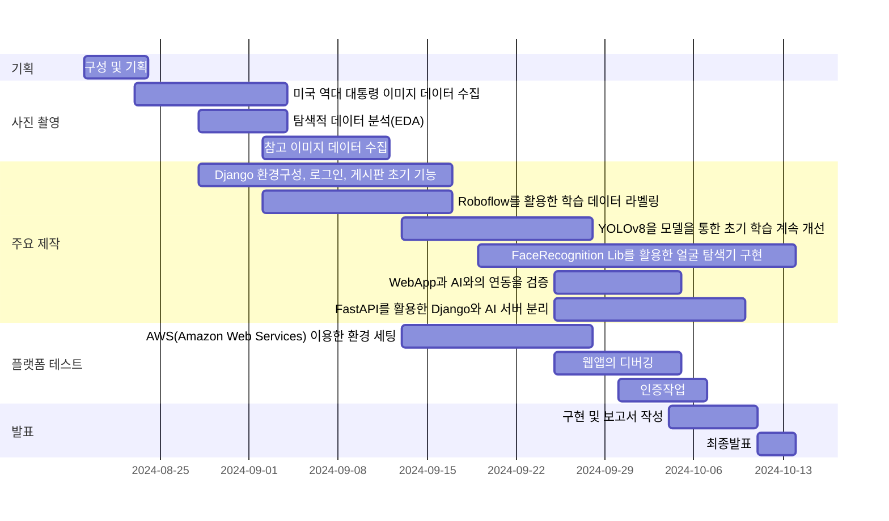

## 5. 역할 분담

- 팀장 : 강유화
- 박상준
- 조하나
- 이예은

## 6. 와이어프레임 / UI / BM

### 6.1 와이어프레임

- 아래 페이지별 상세 설명, 더 큰 이미지로 하나하나씩 설명 필요
- 추후 추가 예정


### 6.2 화면 설계

 


## 7. 데이터베이스 구조도(ERD)

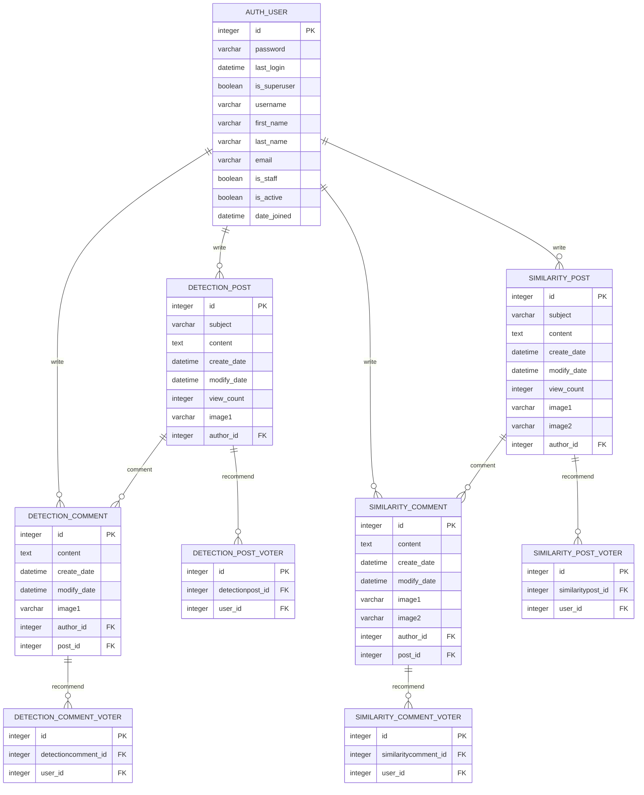


## 8. Architecture

- 시스템 설계

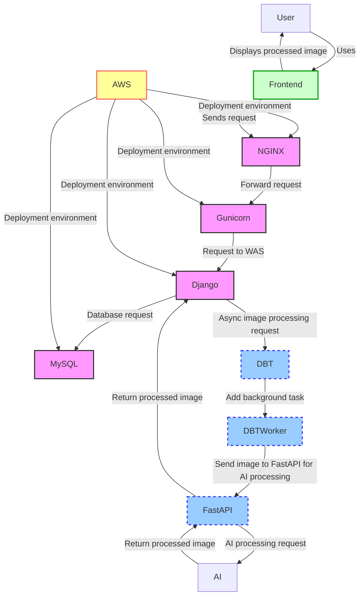

- 설계도 이미지 파일


- 이미지 기능 처리 플로우 차트
  
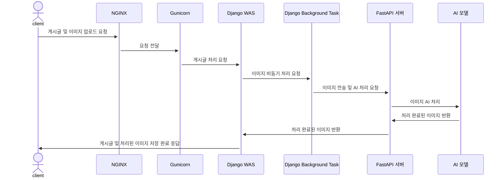

## 9. 주요 기능 설명

- 사용자가 웹페이지에 접속하면 메인 화면이 나오고, 사이드바에서 두 개의 게시판으로 이동하거나 로그인 또는 회원 가입을 할 수 있습니다.

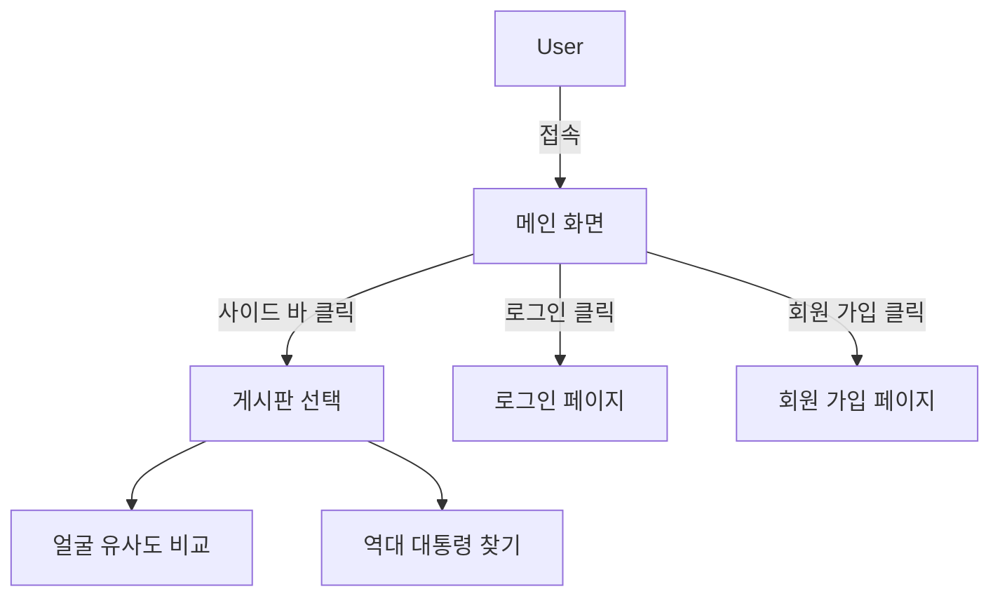

- 얼굴 유사도 비교 기능: 사용자가 두 명의 인물 사진을 업로드하면 유사도를 측정하여 정확도를 퍼센트로 표시합니다. 
사용자가 업로드한 사진 두 개를 비교해 AI가 얼굴 유사도를 분석하고, 결과를 댓글 형태로 제공합니다.

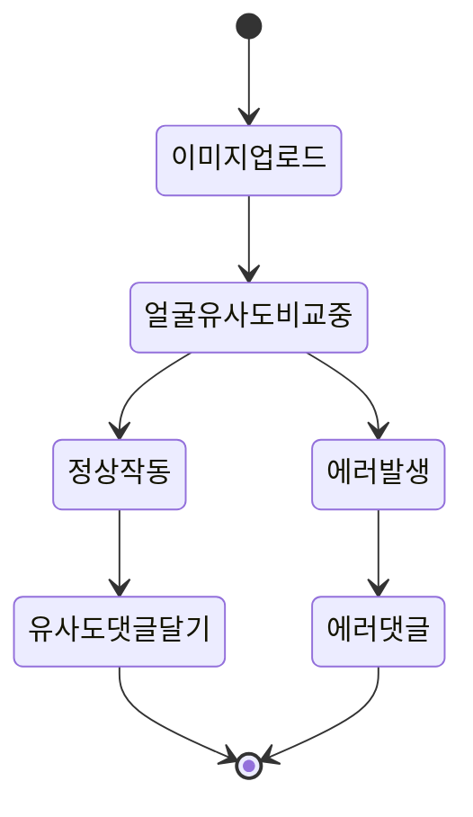

- 역대 대통령 찾기 기능: 사용자가 한 장의 이미지를 업로드하면 그 이미지에서 미국 역대 대통령이 있는지 탐색하고, 
관련된 정보글을 제공합니다. 대통령을 찾은 경우 바운딩박스를 표시하여 결과를 댓글 형태로 제공합니다.

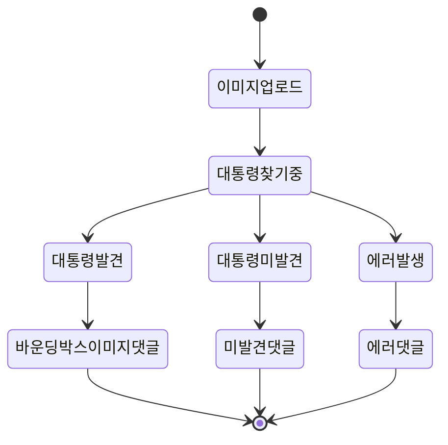

## 10. 클래스 다이어 그램

- Model.py

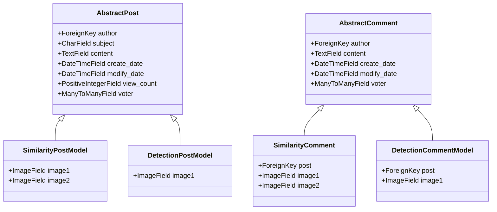

- base_views.py

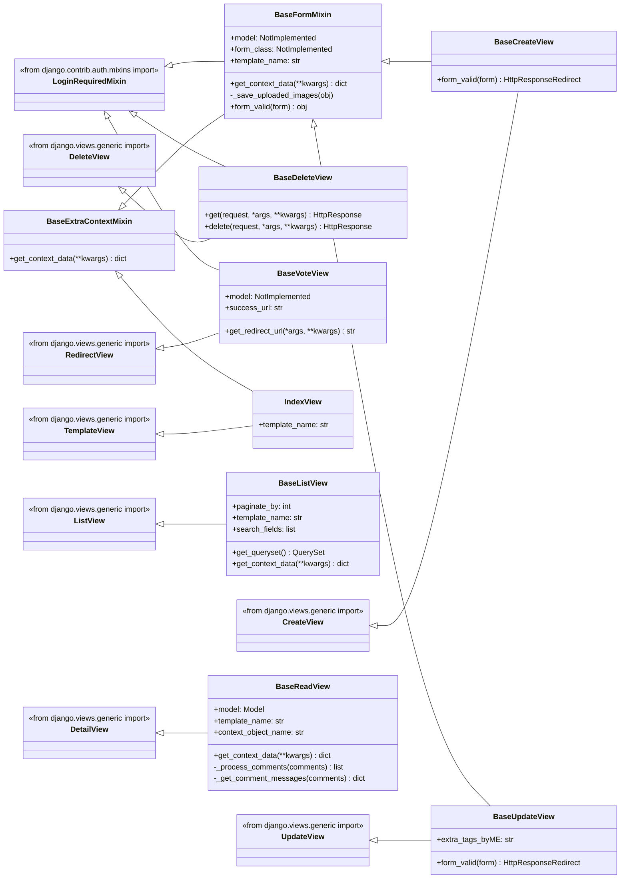

- similarity_post_views.py

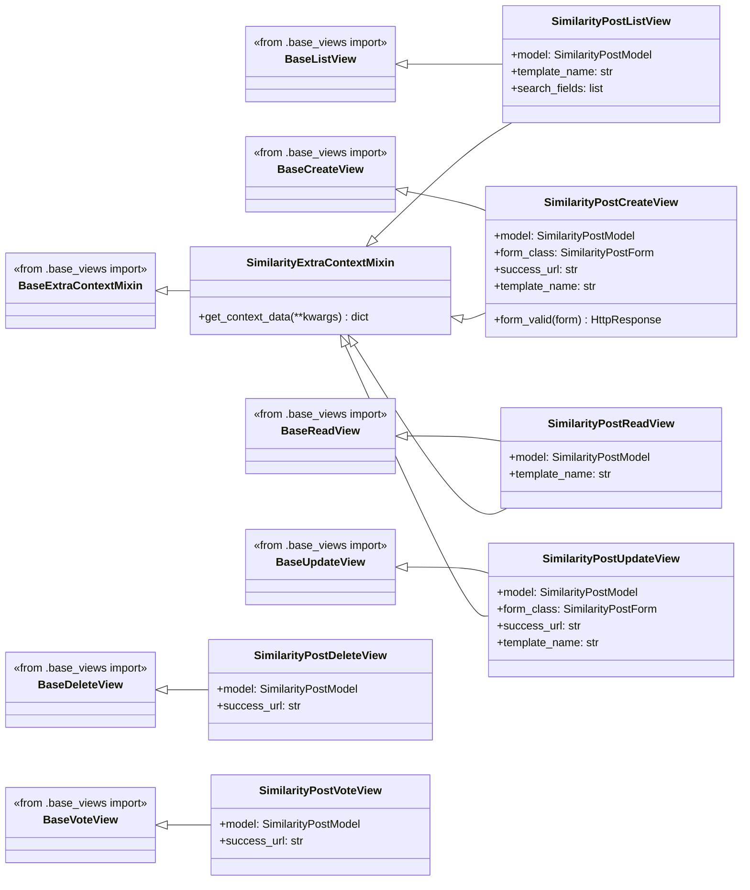

- similarity_comment_views.py

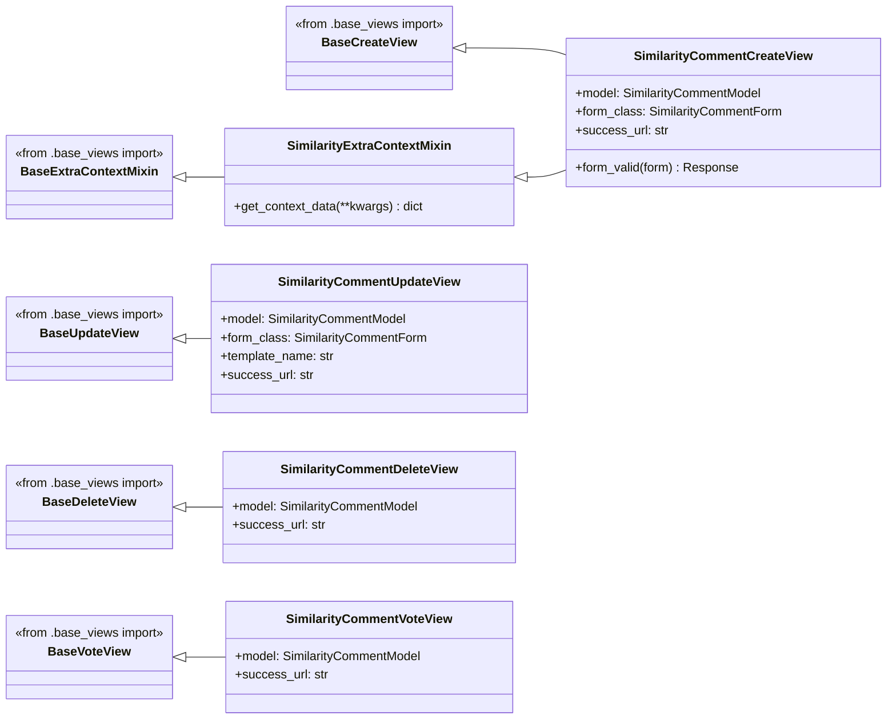

- detection_post_views.py

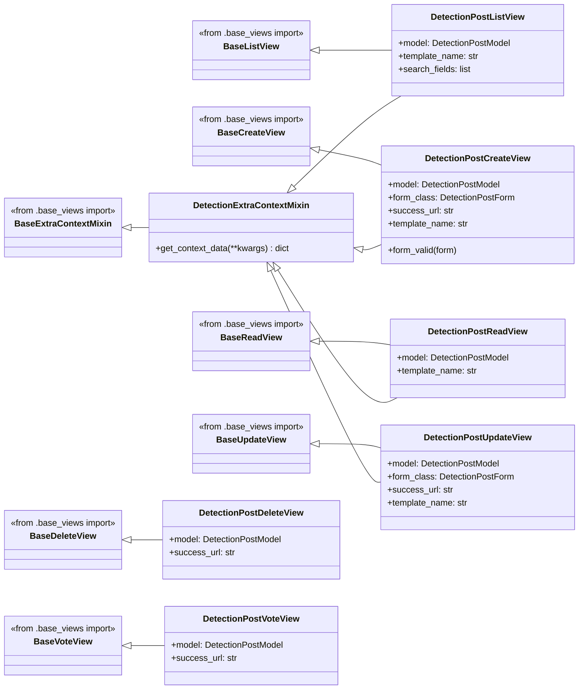

- detection_comment_views.py

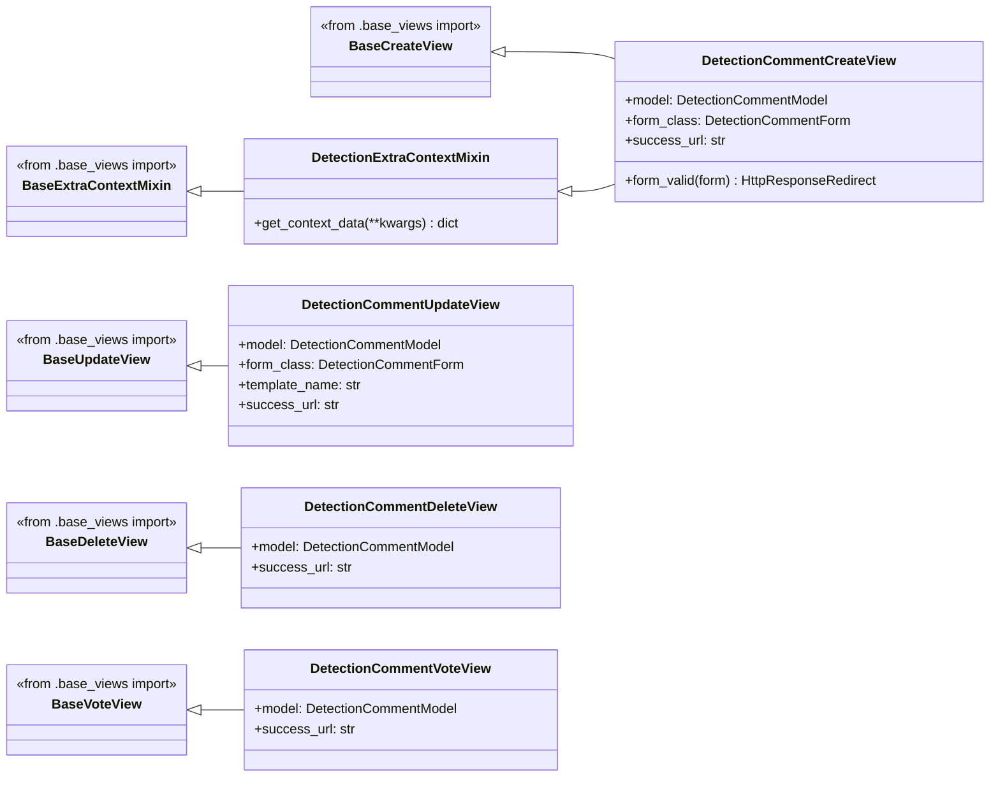

# 트러블 슈팅

## Django 모델 업데이트 시 마이그레이션 에러

### 문제
- Django 모델의 필드를 업데이트할 때 마이그레이션 에러 발생.
- 기존 필드 삭제 또는 새로운 필드 추가 시 데이터베이스와 모델 간의 불일치가 원인.

### 해결 방안
1. `makemigrations`와 `migrate` 명령을 순차적으로 실행.
2. 필드 삭제 시 데이터 손실 방지를 위해 먼저 필드를 nullable로 설정.
3. 데이터베이스 백업을 주기적으로 진행하여 데이터 손실 가능성 대비.
4. 주요 변경 사항 전 테스트 환경에서 사전 적용하여 잠재적 에러를 파악.
5. 데이터 이전 스크립트를 작성하여 기존 데이터와의 호환성을 유지.

### 결과
- 데이터베이스 안정성과 모델 동기화를 성공적으로 유지.
- 마이그레이션 과정에서 발생할 수 있는 문제 최소화.

---

## AI 모델 학습 시 데이터셋 부족 및 구분 문제

### 문제
- 데이터셋 부족과 유사한 얼굴 간의 구분 문제 발생.

### 해결 방안
1. **YOLOv8 전이 학습**: 사전 학습된 YOLOv8 모델을 활용하여 제한된 데이터셋에서도 높은 성능 도출.
2. **데이터 증강**: 회전, 크기 조정, 밝기 변화 등의 데이터 증강 기법을 활용하여 데이터 다양성 극대화.
3. **k-Fold 교차 검증**: 데이터셋을 다수의 부분으로 나누고 순차적으로 검증 데이터셋으로 활용하여 모델 일반화 성능 향상.

### 결과
- 데이터 부족 문제 완화.
- 모델 안정성과 성능 향상.

---

## URL 패턴, View, Template 연동 문제

### 문제
- URL 패턴 변경 시 View와 Template 간의 비효율적 작업 발생.

### 해결 방안
1. 일관성 있는 URL 패턴 지정 및 하드코딩 제거.
2. View의 제네릭 뷰 이름을 일관성 있게 변경하고 함수와 반복문으로 URL 생성.
3. Django의 `get_context_data` 메서드를 오버라이딩하여 사용자 정의 컨텍스트 추가.
4. Custom Template Tag 정의하여 Template에서 URL 패턴 변경의 영향을 최소화.
5. 제네릭 뷰와 커스텀 Base 뷰 활용으로 코드 중복 제거 및 관리 효율성 향상.

### 결과
- URL 변경에 따른 유지보수 부담 감소.
- View와 Template 간의 연동 효율성 향상.

---

## Ubuntu 서버 환경에서 systemd service 파일 DBT 실행 문제

### 문제
- Django Background Task(DBT) 실행 시 MySQL 데이터베이스에 접근하지 못하는 에러 발생.

### 해결 방안
1. Gunicorn 서비스 파일에 `python manage.py process_tasks &` 명령 추가.
2. Gunicorn이 Django 서버를 시작한 후 DBT가 실행되도록 설정.

### 결과
- DBT의 실행 순서를 조정하여 문제 해결.
- Django 환경 변수 의존성을 고려한 안정적 서비스 실행.

---

# 개발하며 느낀점

이번 프로젝트는 Python, HTML/CSS/JS, Django, MySQL, AWS Lightsail, 그리고 GitHub를 활용하여 유명 인물 영상 분석 및 Q&A 웹 게시판 시스템을 구현한 경험이었습니다.

## 주요 내용

1. **MVT 패턴 심화 학습**
   - Django 프레임워크의 MVT 패턴을 학습하고 클래스를 설계하여 웹 시스템 구축.

2. **AI 시스템 통합**
   - 외부 Python 파일을 모듈로 호출하여 AI 시스템과 웹 시스템을 통합.
   - 이전 프로젝트보다 고도화된 기술 적용.

3. **클래스 설계 및 리팩토링**
   - 약 1000줄의 AI 시스템 코드를 SOLID 원칙에 기반하여 재구성.
   - 단일 책임 원칙을 준수하며 각 기능을 독립적인 클래스로 분리.
   - TensorFlow의 Sequential 클래스를 참고한 Pipeline 클래스 구현.
   - 함수형 프로그래밍의 클로저 패턴을 적용하여 코드 재사용성과 가독성 향상.

4. **Git-flow 전략 활용**
   - `main`, `dev`, `feature` 브랜치를 통해 코드 병합 및 협업 효율성 개선.

5. **AWS Lightsail 배포 경험**
   - Ubuntu 환경에서 NGINX와 Gunicorn 설정.
   - Linux 명령어, 파일 권한 설정, 서비스 관리 등을 심도 있게 학습.

6. **서버 분리 확장 경험**
   - AI 이미지 처리의 비효율성을 개선하기 위해 AI 처리 부분을 fastAPI기반의 별도 API 서버로 분리.
   - Locust를 활용하여 109건의 요청을 시뮬레이션한 결과, 17건의 실패가 발생하는 것을 확인

---

## 결론

이번 프로젝트는 기술적인 도전뿐만 아니라 협업 도구 및 워크플로우 최적화의 중요성을 깨닫는 계기가 되었으며, 비동기 처리와 실시간 데이터 처리 기술을 심화 학습하여 향후 대규모 시스템에서도 안정적이고 효율적인 서비스를 제공할 수 있는 개발자로 성장하고자 하는 목표를 다지게 했습니다.

---

# 앞으로의 개선점

1. **모델 성능 개선 및 기능 추가**
   - **AI 모델 최적화**: YOLOv8 외에 Faster R-CNN, Swin Transformer와 같은 최신 모델을 적용하여 성능 비교 및 최적화.
   - **대조 학습(Contrastive Learning)**: 유사한 클래스 간 구분 성능을 높이기 위한 학습 방법론 적용.
   - **기능 추가**: 프로젝트 시간상의 문제 그리고 소재문제 때문에 하지 못하였던 기능 추가

2. **비동기 처리 강화**
   - 현재 FastAPI를 통한 AI 서버와의 비동기 통신은 안정적이나, **Redis나 RabbitMQ 기반의 메시지 큐**를 활용하여 확장성과 안정성을 추가적으로 확보.
   - Django와 FastAPI 간의 통신 속도를 최적화하기 위해 **gRPC**와 같은 경량 통신 프로토콜 도입 검토.

3. **시스템 안정성 및 보안**
   - **AWS CloudWatch**와 같은 모니터링 도구를 활용하여 서버 성능 및 장애를 실시간 감시.
   - 사용자 데이터 보호를 위해 **SSL 인증서** 적용 및 데이터베이스 접근 제어 강화.
   - 코드 스캔 도구(예: SonarQube)를 활용한 보안 취약점 사전 탐지.

4. **UI/UX 개선**
   - 게시판 레이아웃 및 이미지를 더욱 직관적으로 개선하여 사용자 경험을 향상.
   - 모바일 사용자를 위해 **반응형 웹 디자인** 적용.
   - 파일 업로드 진행 상황을 실시간으로 표시하는 기능 추가.

5. **배포 자동화**
   - GitHub Actions와 같은 CI/CD 도구를 활용하여 코드 변경 시 자동으로 배포되는 파이프라인 구축.
   - 도커 컨테이너 기반의 환경 분리 및 배포를 통해 유연성을 확보.

6. **다국어 지원**
   - 글로벌 사용자 확대를 위해 **i18n** 및 **l10n** 적용.
   - Django 번역 시스템을 활용하여 다국어를 지원하는 기능 추가.

7. **로드 테스트 및 성능 최적화**
   - Locust 및 JMeter로 부하 테스트를 정기적으로 수행하여 동시 사용자 증가에 대비.
   - MySQL 쿼리 최적화 및 캐싱 도입으로 DB 성능 향상.

8. **커뮤니티 기능 확장**
   - 댓글과 답글에 **멘션(@) 기능** 추가.
   - 게시물 공유 및 SNS 연동 기능 구현.
   - 인기 게시물을 상단에 고정하는 핀 기능 추가.

9. **데이터 시각화**
   - 사용자와 AI 분석 결과 간의 상호작용을 강화하기 위해 **D3.js**를 활용한 인터랙티브 시각화 도구 제공.
   - 분석 결과를 차트나 그래프로 보여주는 대시보드 개발.

10. **추가 AI 기능**
    - 인물 사진 외에 **동영상 분석** 기능 추가.
    - 사용자 얼굴 데이터를 기반으로 **개인화된 피드 추천** 기능 구현.

---

## 최종 목표
이 프로젝트는 기술 스택, 비동기 처리, AI 모델링, UX 개선 및 보안 강화 등을 지속적으로 발전시켜, 대규모 사용자 환경에서도 안정적이고 효율적인 서비스를 제공하는 웹 플랫폼으로 확장하는 데에 초점을 맞추고 있습니다.


